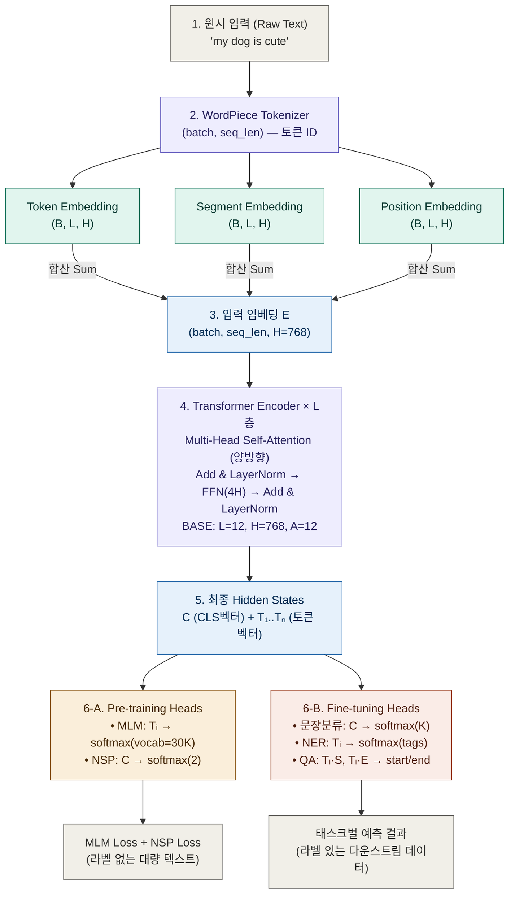

# 📘 BERT 논문 분석

> **BERT: Pre-training of Deep Bidirectional Transformers for Language Understanding**
> Jacob Devlin, Ming-Wei Chang, Kenton Lee, Kristina Toutanova (Google AI Language, 2019)
> [arXiv:1810.04805](https://arxiv.org/abs/1810.04805)

비전공자도 이해할 수 있도록 정리한 BERT 논문 학습 노트입니다.

---

## 📑 목차

1. [Abstract 3줄 요약](#1-abstract-3줄-요약)
2. [Introduction + Conclusion](#2-introduction--conclusion)
3. [핵심 구조 설명](#3-핵심-구조-설명)
4. [구조 시각화](#4-구조-시각화)
5. [논문 ↔ 코드 연결 (PyTorch)](#5-논문--코드-연결-pytorch)
6. [데이터 흐름 추적 (Shape 변화)](#6-데이터-흐름-추적-shape-변화)
7. [면접 예상 질문](#7-면접-예상-질문)

---

## 1. Abstract 3줄 요약

- **문제:** 기존 언어모델(GPT, ELMo)은 단방향이거나 얕은 양방향이라, 양쪽 문맥을 깊이 이해해야 하는 NLP 태스크에서 성능이 제한된다.
- **방법:** 입력 문장의 일부 단어를 가리고(Masked LM) 그 단어를 맞추는 방식 + 두 문장이 이어지는지 맞추는(NSP) 방식으로, 양방향 Transformer Encoder를 사전학습한다.
- **결과:** 단 하나의 출력 레이어만 추가해 파인튜닝하면, 11개 NLP 태스크에서 모두 SOTA 달성 (GLUE 80.5%, SQuAD v1.1 F1 93.2, SQuAD v2.0 F1 83.1).

---

## 2. Introduction + Conclusion

### 🤔 왜 이 논문이 나왔는가?

당시 NLP에는 사전학습된 언어모델을 활용하는 두 가지 방식이 있었다.

- **Feature-based (ELMo):** 사전학습된 표현을 "추가 피처"로만 사용. 태스크마다 별도의 복잡한 모델 구조를 만들어야 함.
- **Fine-tuning (GPT):** 사전학습된 모델 전체를 다운스트림 태스크에 맞춰 미세조정. 더 간단함.

### ❌ 기존 방식의 한계

**가장 큰 문제는 "단방향성"이다.**

- GPT는 왼쪽 → 오른쪽으로만 문맥을 본다. `"The cat sat on the ___"`에서 ___ 다음 단어를 볼 수 없음.
- ELMo는 왼쪽→오른쪽과 오른쪽→왼쪽 모델을 각각 학습한 뒤 "얕게(shallow)" 이어 붙임. 진짜 양방향이 아님.

**이게 왜 문제인가?** 질의응답(QA), 개체명 인식(NER) 같은 토큰 단위 태스크에서는 단어의 앞뒤 문맥을 모두 봐야 정답을 알 수 있다.

### ✅ BERT의 개선점

1. **진짜 양방향 학습** → "Masked Language Model (MLM)"이라는 빈칸 채우기 방식을 도입해서, 모든 레이어에서 좌우 문맥을 동시에 참고할 수 있게 함.
2. **문장 관계 학습** → "Next Sentence Prediction (NSP)" 태스크로 두 문장의 관계까지 학습.
3. **통일된 구조** → 사전학습과 파인튜닝의 모델 구조가 거의 동일. 출력 레이어 하나만 갈아 끼우면 됨.

> 💡 BERT는 "양방향 사전학습이 진짜로 효과 있다"는 걸 11개 태스크에서 SOTA로 증명한 논문이며, 이후 NLP의 패러다임을 바꿔놓았다.

---

## 3. 핵심 구조 설명

### 🧩 구성 요소 1. WordPiece Tokenizer

> **비유:** 단어를 통째로 외우지 않고 "조각(piece)"으로 쪼개서 외우는 방식. 영어 단어 `"playing"`을 `"play"`와 `"##ing"`으로 나누는 식.

| 항목 | 설명 |
|---|---|
| **이게 뭔지** | 입력 텍스트를 미리 정한 30,000개의 토큰 단위로 쪼개는 도구 |
| **입력값** | 문자열 (예: `"my dog is playing"`) |
| **출력값** | 토큰 ID 리스트 (예: `[101, 2026, 3899, 2003, 2652, 102]`) |
| **하이퍼파라미터** | 어휘 크기(vocab size = 30,000) |

---

### 🧩 구성 요소 2. Input Embedding (3가지 임베딩의 합)

> **비유:** 단어 하나를 표현할 때 "이 단어가 뭔지(Token) + 어느 문장인지(Segment) + 몇 번째 위치인지(Position)"를 모두 더해서 하나의 벡터로 만든다. 마치 사람이 누군가를 소개할 때 "이름 + 소속 + 좌석번호"를 다 알려주는 것과 같다.

| 항목 | 설명 |
|---|---|
| **이게 뭔지** | 토큰을 모델이 이해할 수 있는 벡터로 바꾸는 단계 (세 임베딩을 더해서 만듦) |
| **입력값** | 토큰 ID 리스트 `(batch, seq_len)` |
| **출력값** | 임베딩 텐서 `(batch, seq_len, H)` — H는 hidden size (BASE=768, LARGE=1024) |
| **하이퍼파라미터** | Hidden size(H), Max sequence length(512), Vocab size(30,000), Segment 개수(2) |

**세 가지 임베딩:**
- **Token Embedding:** 단어의 의미
- **Segment Embedding:** 첫 번째 문장(A)인지 두 번째 문장(B)인지
- **Position Embedding:** 시퀀스 내 위치 (BERT는 학습 가능한 position embedding을 씀, sinusoidal 아님)

---

### 🧩 구성 요소 3. Transformer Encoder (BERT의 본체)

> **비유:** 한 단어가 문장 안의 다른 모든 단어들에게 "너랑 나랑 얼마나 관련 있어?"라고 물어보고, 관련 깊은 단어의 정보를 더 많이 가져와서 자기 자신을 업데이트하는 회의실. 이걸 여러 층으로 쌓아 점점 풍부한 의미 표현을 만든다.

| 항목 | 설명 |
|---|---|
| **이게 뭔지** | Self-Attention을 사용해 각 토큰이 양방향으로 모든 토큰을 참조하며 문맥 정보를 학습하는 블록 |
| **입력값** | `(batch, seq_len, H)` |
| **출력값** | `(batch, seq_len, H)` (shape 동일, 의미만 풍부해짐) |
| **하이퍼파라미터** | L (블록 수), H (hidden size), A (attention head 수), FFN size = 4H, GELU, Dropout 0.1 |

| 모델 | L | H | A | 파라미터 |
|---|---|---|---|---|
| BERT-BASE | 12 | 768 | 12 | 110M |
| BERT-LARGE | 24 | 1024 | 16 | 340M |

> ⚠️ **핵심 포인트:** GPT의 Transformer는 "마스킹된 self-attention"(왼쪽만 봄)을 쓰지만, BERT는 "양방향 self-attention"(전체를 봄)을 쓴다. 이게 두 모델의 결정적 차이다.

---

### 🧩 구성 요소 4. Masked Language Model (MLM) — **(핵심)**

> **비유:** 영어 시험에서 빈칸 채우기 문제다. `"The cat ___ on the mat"` → `"sat"`을 맞추라는 것. 단, BERT는 문장 전체를 다 보면서 빈칸을 채울 수 있다(양방향).

| 항목 | 설명 |
|---|---|
| **이게 뭔지** | 입력 토큰 중 15%를 무작위로 가리고, 모델이 원래 단어를 맞추도록 학습하는 사전학습 태스크 |
| **입력값** | 일부 토큰이 가려진 시퀀스 `(batch, seq_len)` |
| **출력값** | 가려진 위치에서 vocab 전체에 대한 확률 분포 `(batch, num_masked, vocab_size=30000)` |
| **하이퍼파라미터** | 마스킹 비율 15%, 마스킹 전략 80/10/10, Cross Entropy Loss |

**80/10/10 전략 (선택된 15% 안에서):**
- 80%는 `[MASK]` 토큰으로 교체
- 10%는 랜덤 단어로 교체
- 10%는 원래 단어 유지

> 🤔 **왜 이런 복잡한 전략을 쓰나?**
> 사전학습 때만 `[MASK]` 토큰이 등장하고 파인튜닝 때는 없다. 이 "불일치"를 줄이려고, 모든 토큰이 "혹시 내가 예측 대상일지 모른다"는 자세를 유지하게끔 만든 것.

---

### 🧩 구성 요소 5. Next Sentence Prediction (NSP) — **(핵심)**

> **비유:** 두 문단을 보여주고 "이 두 문단이 원래 이어지는 글이었어?"라고 묻는 OX 퀴즈. QA나 자연어 추론처럼 두 문장 사이 관계를 봐야 하는 태스크에서 도움이 된다.

| 항목 | 설명 |
|---|---|
| **이게 뭔지** | 두 문장(A, B)이 실제로 연속인지(IsNext) 무작위 쌍인지(NotNext) 맞추는 이진 분류 태스크 |
| **입력값** | `[CLS] 문장A [SEP] 문장B [SEP]` 형태의 시퀀스 |
| **출력값** | `[CLS]` 위치의 벡터를 이용한 IsNext/NotNext 이진 분류 `(batch, 2)` |
| **하이퍼파라미터** | 긍정/부정 샘플 비율 50:50, Cross Entropy Loss (MLM loss와 합산) |

---

### 🧩 구성 요소 6. Special Tokens

| 토큰 | 비유 | 역할 |
|---|---|---|
| `[CLS]` | 회의의 "요약 담당자" | 시퀀스 맨 앞. 마지막 레이어의 `[CLS]` 벡터(C ∈ ℝ^H)는 분류 태스크의 대표값 |
| `[SEP]` | "여기까지가 한 문장" 표지판 | 문장 사이 구분자 |
| `[MASK]` | 빈칸 채우기의 `___` | MLM 학습용 마스킹 토큰 |

---

### 🧩 구성 요소 7. Pre-training vs Fine-tuning

> **비유:** Pre-training은 "초중고 일반 교육"이고, Fine-tuning은 "대학에서 전공 공부". 같은 사람(같은 파라미터)이 일반 지식을 쌓은 뒤, 특정 분야로 특화되는 것.

| 단계 | 데이터 | 학습 시간 |
|---|---|---|
| **Pre-training** | BooksCorpus(800M) + Wikipedia(2,500M) = 33억 단어 | 1M step, 4일 (TPU 4~16개) |
| **Fine-tuning** | 태스크별 라벨 데이터 | 1시간 ~ 몇 시간 (단일 GPU/TPU) |

> 💡 **이게 BERT의 진짜 매력:** 비싼 사전학습은 구글이 한 번만 하고, 우리는 가벼운 파인튜닝만으로 SOTA 모델을 만들 수 있다.

---

## 4. 구조 시각화



---

## 5. 논문 ↔ 코드 연결 (PyTorch)

### 📍 논문 표현 ↔ 코드 매핑

| 논문 표현 | PyTorch 코드 |
|---|---|
| "WordPiece embeddings with 30,000 vocab" | `nn.Embedding(30000, hidden_size)` |
| "Token + Segment + Position embedding을 합산" | `token_emb + segment_emb + position_emb` |
| "Multi-layer bidirectional Transformer encoder" | `nn.TransformerEncoder(layer, num_layers=L)` |
| "Multi-head self-attention" | `nn.MultiheadAttention(H, num_heads=A)` |
| "FFN size = 4H" | `nn.Linear(H, 4*H) → GELU → nn.Linear(4*H, H)` |
| "GELU activation instead of ReLU" | `nn.GELU()` |
| "Dropout probability = 0.1" | `nn.Dropout(0.1)` |
| "Final hidden of [CLS] is C ∈ ℝ^H" | `pooled_output = hidden_states[:, 0, :]` |
| "MLM: predict masked tokens over vocab" | `nn.Linear(H, vocab_size)` → CrossEntropyLoss |
| "NSP: binary classification with C" | `nn.Linear(H, 2)` → CrossEntropyLoss |
| "Classification: log(softmax(C·Wᵀ))" | `nn.Linear(H, num_classes)` |

---

### 💻 전체 모델 PyTorch 구현 예시

```python
import torch
import torch.nn as nn


class BertEmbeddings(nn.Module):
    """3가지 임베딩을 합산: Token + Segment + Position"""
    def __init__(self, vocab_size=30000, hidden_size=768,
                 max_len=512, num_segments=2):
        super().__init__()
        self.token_emb    = nn.Embedding(vocab_size, hidden_size)
        self.segment_emb  = nn.Embedding(num_segments, hidden_size)
        self.position_emb = nn.Embedding(max_len, hidden_size)
        self.layer_norm   = nn.LayerNorm(hidden_size)
        self.dropout      = nn.Dropout(0.1)

    def forward(self, input_ids, segment_ids):
        # input_ids:   (batch, seq_len)
        # segment_ids: (batch, seq_len)
        B, L = input_ids.shape
        positions = torch.arange(L, device=input_ids.device).unsqueeze(0).expand(B, L)

        emb = (self.token_emb(input_ids)
             + self.segment_emb(segment_ids)
             + self.position_emb(positions))   # (B, L, H)
        return self.dropout(self.layer_norm(emb))


class BertLayer(nn.Module):
    """Transformer Encoder 1개 블록: Self-Attention + FFN"""
    def __init__(self, hidden_size=768, num_heads=12, ffn_size=3072):
        super().__init__()
        self.attention = nn.MultiheadAttention(
            hidden_size, num_heads, dropout=0.1, batch_first=True
        )
        self.norm1 = nn.LayerNorm(hidden_size)
        self.ffn = nn.Sequential(
            nn.Linear(hidden_size, ffn_size),
            nn.GELU(),                 # ⚠️ ReLU 아님!
            nn.Linear(ffn_size, hidden_size),
            nn.Dropout(0.1),
        )
        self.norm2 = nn.LayerNorm(hidden_size)

    def forward(self, x, attention_mask=None):
        # Self-Attention (양방향: 모든 토큰이 모든 토큰을 봄)
        attn_out, _ = self.attention(x, x, x, key_padding_mask=attention_mask)
        x = self.norm1(x + attn_out)           # Add & Norm

        # Feed-Forward Network
        ffn_out = self.ffn(x)
        x = self.norm2(x + ffn_out)            # Add & Norm
        return x


class BERT(nn.Module):
    """BERT-Base: L=12, H=768, A=12"""
    def __init__(self, vocab_size=30000, hidden_size=768,
                 num_layers=12, num_heads=12, ffn_size=3072):
        super().__init__()
        self.embeddings = BertEmbeddings(vocab_size, hidden_size)
        self.encoder = nn.ModuleList([
            BertLayer(hidden_size, num_heads, ffn_size)
            for _ in range(num_layers)
        ])

        # Pre-training Heads
        self.mlm_head = nn.Linear(hidden_size, vocab_size)  # MLM
        self.nsp_head = nn.Linear(hidden_size, 2)           # NSP

    def forward(self, input_ids, segment_ids, attention_mask=None):
        # 1. Embedding
        x = self.embeddings(input_ids, segment_ids)         # (B, L, H)

        # 2. Transformer 블록 L번 통과
        for layer in self.encoder:
            x = layer(x, attention_mask)                    # (B, L, H)

        # 3. 출력
        C = x[:, 0, :]                # [CLS] 벡터: (B, H)
        T = x                         # 토큰별 벡터: (B, L, H)

        mlm_logits = self.mlm_head(T) # (B, L, vocab_size)
        nsp_logits = self.nsp_head(C) # (B, 2)
        return mlm_logits, nsp_logits, C, T


# === 사용 예시 ===
model = BERT()
input_ids   = torch.randint(0, 30000, (2, 128))   # (batch=2, seq=128)
segment_ids = torch.zeros(2, 128, dtype=torch.long)

mlm_logits, nsp_logits, C, T = model(input_ids, segment_ids)
print(mlm_logits.shape)  # torch.Size([2, 128, 30000])
print(nsp_logits.shape)  # torch.Size([2, 2])
print(C.shape)           # torch.Size([2, 768])
```

> 💡 **실무 팁:** 실제로는 위 코드를 직접 짜기보다 `transformers` 라이브러리의 `BertModel`을 쓴다. 위 코드는 면접에서 "BERT 구조를 그려보세요" 했을 때 머릿속에 그릴 수 있는 수준으로 이해하기 위한 것.

---

## 6. 데이터 흐름 추적 (Shape 변화)

**가정:** batch=2, seq_len=128, BERT-Base (H=768, L=12, A=12, vocab=30,000)

```
입력 텍스트 "[CLS] my dog is cute [SEP]"
           ↓ WordPiece Tokenizer
input_ids:    (2, 128)          # 정수 ID
segment_ids:  (2, 128)          # 0 또는 1

           ↓ [Embedding Layer] Token+Segment+Position을 합산
embeddings:   (2, 128, 768)     # 각 토큰이 768차원 벡터로 변환됨

           ↓ [Transformer Block 1] Self-Attention + FFN
hidden:       (2, 128, 768)     # shape 동일, 의미만 풍부해짐 (양방향 문맥 반영)

           ↓ [Transformer Block 2~12] 동일한 연산 11번 반복
hidden:       (2, 128, 768)     # 깊은 양방향 표현 학습

           ↓ [최종 Hidden State 분리]
C (CLS벡터):  (2, 768)          # hidden[:, 0, :] → 문장 전체 대표
T (토큰벡터): (2, 128, 768)     # hidden 전체 → 토큰별 의미

           ↓ [MLM Head]  T를 vocab 공간으로 사영
mlm_logits:   (2, 128, 30000)   # 각 위치마다 30000개 단어 확률

           ↓ [NSP Head]  C를 이진 분류 공간으로 사영
nsp_logits:   (2, 2)            # IsNext/NotNext 두 클래스
```

### 📍 각 단계 한 줄 설명

| 변화 | 이유 |
|---|---|
| `(2,128) → (2,128,768)` | 정수 토큰 ID가 768차원의 의미 벡터로 변환됨 (lookup table) |
| `(2,128,768) → (2,128,768)` × 12회 | Self-Attention으로 토큰 간 관계 학습. shape는 유지, 의미는 풍부해짐 |
| `(2,128,768) → (2,768)` | `[CLS]` 위치(0번 인덱스)만 뽑아냄. 문장 전체를 요약하는 벡터 |
| `(2,128,768) → (2,128,30000)` | 각 토큰 위치에서 vocab 30,000개 중 어떤 단어인지 예측 (MLM) |
| `(2,768) → (2,2)` | `[CLS]` 벡터로 두 문장이 이어지는지 이진 분류 (NSP) |

### 📍 파인튜닝 시 출력 변화

| 태스크 | 사용 벡터 | 변환 | 최종 shape |
|---|---|---|---|
| **문장 분류 (SST-2)** | C: `(B, 768)` | `Linear(768, 2)` | `(B, 2)` |
| **NER** | T: `(B, L, 768)` | `Linear(768, tags)` | `(B, L, tags)` |
| **QA (SQuAD)** | T: `(B, L, 768)` | `S·Tᵢ`, `E·Tᵢ` | `(B, L)`, `(B, L)` (start/end 확률) |
| **MNLI** | C: `(B, 768)` | `Linear(768, 3)` | `(B, 3)` |

---

## 7. 면접 예상 질문

### Q1. BERT가 GPT와 가장 크게 다른 점은 무엇이며, 왜 그 차이가 중요한가요?

> 💡 **힌트:** 핵심은 "self-attention의 마스킹 방식"이다. GPT는 한 방향만, BERT는 양방향. 어떤 태스크에서 양방향이 결정적으로 유리한지 함께 답하면 좋다 (예: QA, NER).

---

### Q2. MLM에서 마스킹 비율이 15%이고, 그 안에서 다시 80/10/10으로 처리하는 이유는 무엇인가요?

> 💡 **힌트:** "사전학습-파인튜닝 불일치(mismatch)"라는 단어를 떠올려라. 파인튜닝 시에는 `[MASK]` 토큰이 등장하지 않는다는 사실과 연결해서 설명. 또 모델이 어떤 자세를 유지해야 하는지(모든 토큰에 대해 문맥적 표현을 유지)도 함께.

---

### Q3. BERT가 사용하는 3가지 Embedding은 무엇이며, 왜 합산해서 사용하는가요? Position Embedding은 Transformer 원논문의 sinusoidal과 어떻게 다른가요?

> 💡 **힌트:** Token / Segment / Position 각각이 어떤 정보를 담는지 정확히 구분해서 답할 것. Position Embedding은 BERT에서는 학습 가능한(learned) 임베딩을 쓴다는 점이 원조 Transformer와의 차이다.

---

### Q4. `[CLS]` 토큰의 역할은 무엇이고, 사전학습이 끝난 직후의 `[CLS]` 벡터를 그대로 문장 임베딩으로 써도 되나요?

> 💡 **힌트:** 논문 각주에서 명확히 언급되어 있다. "NSP로만 학습된 C는 의미 있는 문장 표현이 아니다"라고. 파인튜닝의 필요성과 연결해서 답하라.

---

### Q5. BERT는 출력 토큰의 양방향 문맥을 사용하는데, 왜 일반적인 좌→우 언어모델로는 양방향 학습이 불가능한가요?

> 💡 **힌트:** "정보 누설(self-seeing)" 문제. 만약 다층 양방향 LM을 그냥 학습시키면, 깊은 층에서 자기 자신을 우회 경로로 볼 수 있다. 이 문제를 BERT가 어떻게 우회(MLM 도입)했는지가 핵심.

---

## 🎯 최종 한 줄 요약

> **BERT는 "양방향 Transformer Encoder"를 "Masked LM + NSP"로 사전학습한 모델이며, 파인튜닝 시 출력 레이어 하나만 추가하면 다양한 NLP 태스크에서 SOTA를 달성한다.** 이 패러다임(Pre-training → Fine-tuning)이 이후 모든 NLP 연구의 표준이 되었다.

면접에서 BERT를 설명할 때는 다음 네 가지를 막힘없이 말할 수 있으면 충분하다:

1. 양방향성의 의미
2. MLM의 80/10/10 트릭
3. `[CLS]`와 `[SEP]`의 역할
4. Pre-training / Fine-tuning 분리의 장점

화이팅! 💪

---

## 📚 참고 자료

- [BERT 논문 (arXiv)](https://arxiv.org/abs/1810.04805)
- [공식 코드 (GitHub)](https://github.com/google-research/bert)
- [HuggingFace Transformers](https://huggingface.co/docs/transformers/model_doc/bert)
- [The Annotated Transformer](http://nlp.seas.harvard.edu/2018/04/03/attention.html)
